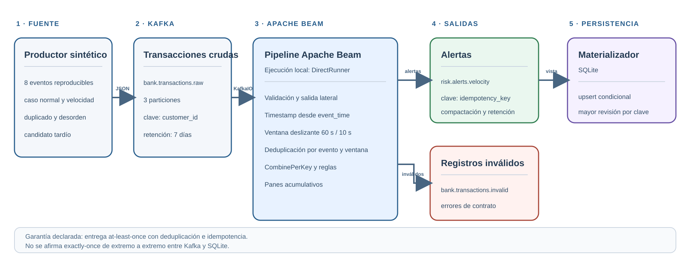

# Detección de velocidad transaccional con Kafka y Apache Beam

Proyecto integrador de **Streaming de datos y sus aplicaciones**, Maestría en Inteligencia Artificial - FPUNA.

**Autora:** Fátima Barrios Ortega

**Entorno de ejecución validado:** Apache Beam DirectRunner

**Caso de uso:** prevención de lavado de dinero y fraude mediante alertas de velocidad transaccional

## Resultados de validación

En este proyecto, una validación **end-to-end** recorre los componentes reales del entorno local: productor, Kafka, pipeline Beam/DirectRunner, tópicos de salida y materializador. Esto demuestra la integración y reproducibilidad del flujo, pero no constituye una certificación para producción.

La ejecución de referencia procesó ocho eventos sintéticos reproducibles y obtuvo:

- 8 eventos consumidos y `LAG=0` en el grupo del pipeline.
- 3 alertas válidas publicadas en `risk.alerts.velocity`.
- 0 eventos enviados a `bank.transactions.invalid`.
- Claves Kafka iguales a `alert_id` e `idempotency_key`.
- 71 pruebas automatizadas para contrato, validación, ventanas, deduplicación, agregación, alertas, materialización y TestStream.
- Análisis reproducible de 300 claves distribuidas frente a una hot key con 80 % de la carga.

Los resultados, su alcance y los archivos de comprobación están inventariados en [`evidence/README.md`](evidence/README.md).

## Problema y decisión que habilita

Un cliente puede fragmentar movimientos en varias transacciones cercanas para evitar controles aislados por operación. El pipeline observa cada cliente en ventanas deslizantes y genera una alerta cuando se cumple al menos una condición:

- **Conteo:** 4 o más transacciones.
- **Monto:** total acumulado igual o superior a **10.000.000 PYG**.

El resultado permite priorizar la revisión de clientes con actividad concentrada. No determina por sí solo que exista lavado o fraude; produce una señal explicable para un proceso posterior de análisis.

## Arquitectura



1. `synthetic_producer.py` genera ocho eventos que incluyen actividad normal, actividad de velocidad, un duplicado intencional y llegadas fuera de orden o tardías.
2. Kafka conserva el flujo crudo en `bank.transactions.raw`; la clave `customer_id` mantiene los eventos del cliente en la misma partición.
3. Beam lee con KafkaIO, valida el contrato, asigna el `event_time` del payload, aplica ventanas, deduplica, agrega y crea alertas.
4. Los resultados válidos se escriben en `risk.alerts.velocity`; los registros rechazados van a `bank.transactions.invalid`.
5. `alert_consumer.py` materializa en SQLite la revisión más alta observada para cada clave idempotente y confirma el offset después del `upsert` durable.

## Contrato de entrada

Ejemplo de `bank.transactions.raw`:

```json
{
  "schema_version": "1.0",
  "event_id": "evt-velocity-001-20260809T195950Z",
  "customer_id": "cust-velocity-001",
  "event_time": "2026-08-09T19:59:50.000Z",
  "payload": {
    "amount": 2500000,
    "currency": "PYG",
    "transaction_type": "transfer",
    "channel": "mobile"
  }
}
```

Decisiones:

- `schema_version` inicia una evolución explícita del contrato.
- `event_id` es estable y permite deduplicar.
- `customer_id` es la clave de negocio, agrupación y particionamiento.
- `event_time` representa cuándo ocurrió la transacción y no cuándo fue procesada.
- `amount` es un entero positivo en PYG para evitar ambigüedad de punto flotante.

## Tópicos Kafka

| Tópico | Particiones | Clave | Uso | Retención / política |
|---|---:|---|---|---|
| `bank.transactions.raw` | 3 | `customer_id` | Eventos crudos | 7 días |
| `risk.alerts.velocity` | 1 | `idempotency_key` | Revisiones de alertas | 7 días; `compact,delete` |
| `bank.transactions.invalid` | 1 | `event_id` o hash | Errores de contrato | 7 días |

Tres particiones en la entrada permiten paralelismo entre clientes y conservan orden por cliente. El escenario de validación usa una sola partición de salida para facilitar la inspección; una operación a mayor escala puede aumentarla porque la clave estable preserva el orden lógico de cada alerta.

### Análisis de skew y hot keys

El comando siguiente compara localmente dos escenarios de 300 eventos sobre las tres particiones de entrada:

```text
python -m src.producer.skew_analysis
```

| Escenario | Partición 0 | Partición 1 | Partición 2 | Mayor participación |
|---|---:|---:|---:|---:|
| 300 clientes | 92 | 116 | 92 | 38,67 % |
| Hot key al 80 % | 258 | 20 | 22 | 86,00 % |

La hot key eleva en 47,33 puntos porcentuales la carga de la partición más ocupada. Más particiones reparten clientes distintos, pero no pueden dividir los eventos de un mismo `customer_id` sin cambiar la clave y las garantías de orden. El procedimiento, la interpretación y el modo opcional que publica contra Kafka están en [`docs/analisis-skew.md`](docs/analisis-skew.md).

## Pipeline Beam

El grafo principal se encuentra en `src/pipeline/streaming_pipeline.py`:

1. `ReadFromKafka` consume registros sin auto-crear tópicos.
2. `ParseAndValidateKafkaRecord` decodifica JSON, valida el esquema y separa inválidos mediante salida etiquetada.
3. `TimestampedValue` asigna el timestamp desde `event_time`.
4. `WindowVelocityEvents` aplica ventanas deslizantes de 60 segundos cada 10 segundos.
5. `DeduplicateEvents` guarda `event_id` por cliente y ventana y limpia el estado al final del horizonte temporal.
6. `AggregateVelocity` utiliza `CombinePerKey` para conteo y monto incremental.
7. `CreateVelocityAlerts` evalúa umbrales y construye revisiones idempotentes.
8. `WriteToKafka` publica alertas e inválidos en sus tópicos correspondientes.

## Política temporal

| Decisión | Configuración | Motivo |
|---|---|---|
| Tiempo | `event_time` del dominio | La métrica debe reflejar cuándo ocurrió la transacción. |
| Ventana | Deslizante 60 s / paso 10 s | Detecta concentración sin depender de un único corte fijo. |
| Watermark | Progreso provisto por la fuente/runner | Determina el cierre lógico de ventanas. |
| Lateness | 30 s | Acepta correcciones acotadas sin retener estado indefinidamente. |
| Trigger | `EARLY` cada 10 s, `ON_TIME`, `LATE` por elemento | Balancea rapidez y corrección. |
| Acumulación | `ACCUMULATING` | Cada revisión representa el total vigente de la ventana. |

La política completa es la predeterminada y está probada con TestStream. El flag `--directrunner-smoke-mode`, utilizado solo en la validación acotada de ocho registros, desactiva el disparo temprano basado en reloj de procesamiento; conserva tiempo de evento, ventanas 60/10, tolerancia a tardíos, acumulación, deduplicación y panes `ON_TIME`/`LATE`.

### Alcance del watermark en la ejecución acotada

KafkaIO se configura con `timestamp_policy="ProcessingTime"`, pero el primer `ParDo` reemplaza el timestamp del elemento con el `event_time` validado del payload. En la ejecución end-to-end acotada, el cierre de la fuente produjo tres panes `ON_TIME`. El comportamiento controlado `ON_TIME`, `LATE`, el descarte fuera de 30 segundos y el cierre definitivo se validan por separado con `tests/integration/test_pipeline_temporal.py` y `TestStream`.

## Duplicados, idempotencia y entrega

- La deduplicación conserva el primer `event_id` por cliente y ventana.
- El estado expira en `window_end + allowed_lateness`, lo que limita memoria y define el horizonte de deduplicación.
- La clave de salida es `velocity|customer_id|window_start_ms|window_end_ms`.
- `alert_id`, `idempotency_key` y la clave Kafka son idénticos.
- Las revisiones de una misma ventana reutilizan la misma clave; un consumidor puede conservar la revisión numéricamente mayor.
- El tópico de alertas admite compactación, por lo que la clave estable es apta para una vista materializada.
- El materializador usa SQLite y un `upsert` condicional: solo una revisión estrictamente mayor modifica la vista; duplicados y revisiones obsoletas no alteran el estado.
- El offset se confirma después de persistir. Si el proceso falla entre ambas operaciones, el mensaje puede repetirse, pero el `upsert` converge al mismo estado.

La solución se declara **at-least-once tolerante a duplicados con efectos idempotentes**. No afirma exactly-once end-to-end: una falla después del `upsert` y antes de confirmar el offset puede reprocesar el mensaje, pero la clave estable y la política de revisión permiten converger en el mismo efecto lógico.

## Prerrequisitos

- Windows, Linux o macOS para la verificación de código multiplataforma.
- PowerShell 5.1 o superior para los scripts guiados de Windows.
- Docker Desktop con Linux containers.
- Python 3.12, 3.13 o 3.14 (la verificación de referencia usó Python 3.14).
- Java/JDK 17 en `PATH`.
- Aproximadamente 4 GB de memoria libre para Kafka y el contenedor Java de KafkaIO.

Versiones validadas:

- `apache/kafka:4.3.1`
- `apache-beam==2.75.0`
- `confluent-kafka==2.12.2`
- `pytest==9.1.1`
- `ruff==0.16.2`

## Instalación

Desde la raíz del repositorio:

```powershell
py -3.14 -m venv .venv
Set-ExecutionPolicy -Scope Process Bypass
& .\.venv\Scripts\Activate.ps1
python -m pip install --upgrade pip
python -m pip install -e ".[dev]"
```

Verificación automatizada:

```powershell
& .\scripts\verify.ps1
```

Verificación equivalente y multiplataforma:

```text
python scripts/verify_project.py
```

El verificador ejecuta la suite, Ruff, validación de Compose y SHA-256 de las evidencias. La guía [`docs/prueba-desde-cero.md`](docs/prueba-desde-cero.md) describe una verificación independiente desde un clon limpio para Windows, Linux y macOS, seguida de la ejecución Kafka -> Beam -> Kafka.

El análisis local de distribución no requiere Docker:

```text
python -m src.producer.skew_analysis
```

Equivalente manual:

```powershell
python -m pytest -q
python -m ruff check .
python -m ruff format --check .
docker compose config --quiet
```

## Ejecución reproducible

Los comandos siguientes recrean el escenario desde un estado Kafka vacío. `docker compose down -v` elimina **solo el volumen `kafka-data` de este proyecto**; no debe usarse si se desea conservar una ejecución anterior.

### 1. Iniciar Kafka y crear tópicos

```powershell
docker compose down -v
docker compose up -d kafka kafka-init
docker compose ps -a
```

### 2. Ejecutar Beam en la terminal A

```powershell
& .\scripts\run-pipeline-directrunner.ps1
```

El proceso espera exactamente ocho registros y termina por sí solo.

### 3. Publicar el escenario en la terminal B

```powershell
python -m src.producer.synthetic_producer `
  --base-time 2026-08-09T19:59:50Z `
  --interval-seconds 0.10 `
  --cycles 1
```

El productor publica ocho mensajes. El duplicado intencional reutiliza el mismo `event_id` y contenido; dos mensajes llegan en orden temporal invertido; el último candidato tardío llega después de un evento que adelanta el tiempo de evento.

### 4. Observar la salida

```powershell
& .\scripts\consume-alerts.ps1
```

Con el `base-time` indicado se esperan tres mensajes de alerta y cero inválidos. También puede verificarse el tamaño de los tópicos sin consumir:

```powershell
docker compose exec -T kafka /opt/kafka/bin/kafka-get-offsets.sh `
  --bootstrap-server kafka:29092 --topic risk.alerts.velocity

docker compose exec -T kafka /opt/kafka/bin/kafka-get-offsets.sh `
  --bootstrap-server kafka:29092 --topic bank.transactions.invalid
```

### 5. Detener el entorno

```powershell
docker compose down
```

Este comando conserva el volumen de Kafka. Para eliminarlo de forma explícita, use `docker compose down -v`.

## Interpretación del resultado de referencia

| Ventana UTC | Conteo | Total PYG | Condición |
|---|---:|---:|---|
| 19:59:40-20:00:40 | 4 | 8.000.000 | conteo |
| 19:59:50-20:00:50 | 5 | 10.500.000 | conteo y monto |
| 20:00:00-20:01:00 | 4 | 8.000.000 | conteo |

El orden de los offsets de salida no tiene que coincidir con el orden cronológico de las ventanas; las tres claves son independientes y la escritura distribuida puede materializarlas en otro orden.

## Pruebas

La suite cubre:

- contrato y serialización determinista;
- validación y salida lateral de inválidos;
- asignación de `event_time`;
- seis ventanas deslizantes por evento;
- `CombineFn` y aislamiento por cliente;
- deduplicación por ventana y expiración de estado;
- umbrales independientes, panes y claves idempotentes;
- TestStream con duplicado, evento tardío aceptado y evento demasiado tardío descartado;
- configuración del pipeline, DirectRunner y KafkaIO;
- productor sintético de ocho eventos;
- distribución balanceada frente a hot key sobre tres particiones;
- materialización durable, reinicio y rechazo de revisiones duplicadas u obsoletas.

Las pruebas de `tests/integration` son integrales a nivel Beam/TestStream y no requieren Kafka externo. La validación Kafka end-to-end se documenta como evidencia y no se repite automáticamente durante `pytest`.

## Estructura

```text
.
|-- compose.yaml
|-- pyproject.toml
|-- README.md
|-- docs/prueba-desde-cero.md
|-- docs/documento-tecnico-streaming-fatima-barrios.docx
|-- docs/documento-tecnico-streaming-fatima-barrios.pdf
|-- docs/presentation/presentacion-defensa-streaming-fatima-barrios.pptx
|-- docs/presentation/presentacion-defensa-streaming-fatima-barrios.pdf
|-- src/
|   |-- common/event_contract.py
|   |-- producer/synthetic_producer.py
|   |-- producer/skew_analysis.py
|   |-- pipeline/
|   |   |-- validation.py
|   |   |-- aggregation.py
|   |   |-- deduplication.py
|   |   |-- alerts.py
|   |   `-- streaming_pipeline.py
|   `-- materializer/alert_consumer.py  # SQLite + upsert por revisión
|-- tests/
|-- evidence/
|-- docs/
`-- scripts/
```

## Límites conocidos

- DirectRunner es adecuado para desarrollo y validación local, no para producción distribuida.
- El watermark de la ejecución end-to-end acotada depende de la fuente y del runner; la política de tardíos se valida de forma determinista con TestStream.
- El estado de deduplicación es runner-managed y no se demuestra recuperación con checkpoint tras una falla real.
- La validación local usa un solo broker, factor de replicación 1 y una sola partición de salida.
- SQLite demuestra persistencia local y reinicio, pero no reemplaza un sink distribuido ni coordina una transacción exactamente-once con Kafka.
- Las reglas usan umbrales fijos y no incorporan segmentación por perfil de riesgo.
- Una hot key permanece en una sola partición; aumentar particiones solo distribuye clientes distintos.

Líneas de evolución: runner distribuido con checkpoints, métricas operativas, monitoreo de registros rechazados, mitigación de hot keys con re-agregación y umbrales por segmento.

## Contribución

Fátima Barrios Ortega realizó el diseño del caso PLD, contrato, arquitectura Kafka, pipeline Beam, política temporal, deduplicación, pruebas, validación end-to-end, documentación y presentación. El proyecto es individual.
